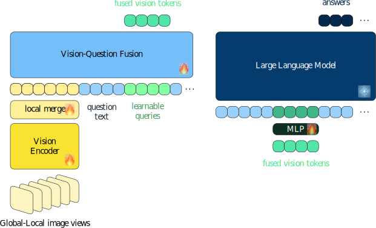
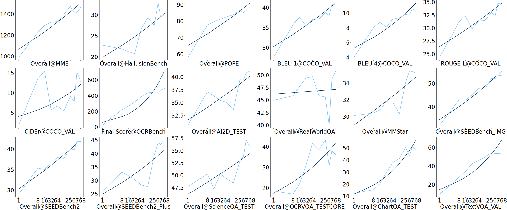
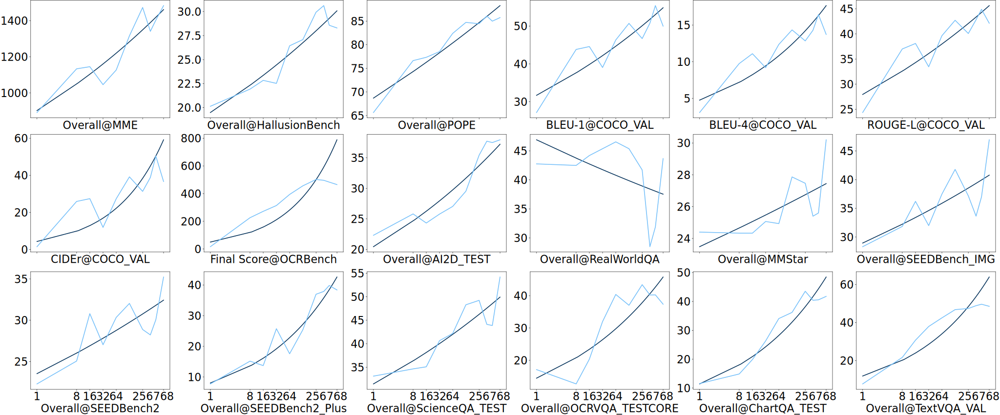
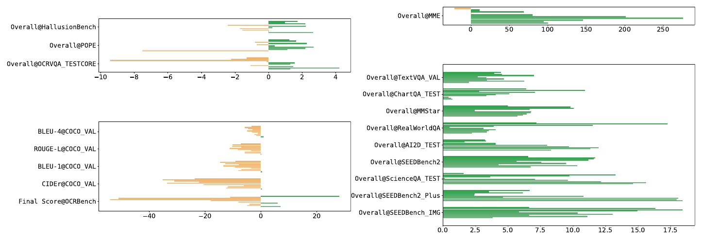

# Token空间的缩放能力：视觉语言模型中视觉token的缩放行为分析

大语言模型的缩放定律已经得到了广泛验证：随着参数规模和训练数据的增加，模型性能呈现可预测的幂律增长。在token空间也有类似的规模定律现象。例如，通过扩展词表、使用n-gram或Engram等方式可以提升预训练模型的性能。那么在视觉语言模型中，视觉token的数量是否也存在类似的缩放行为？

该研究表明，视觉token数量与模型性能遵循可预测的数学关系，类似于语言模型中参数和训练数据的缩放行为。这一发现为视觉语言模型的设计和优化提供思路。

目前，该论文已被接收，代码已开源。

- 论文地址：https://jmlr.org/papers/v26/24-2243.html
- 代码链接：https://github.com/tenghuilee/ScalingCapFusedVisionLM.git
- 模型权重：https://modelscope.cn/models/LiTenghui/scalingcapabilitytokenspace

## 研究背景：视觉token的权衡

视觉语言模型通常将图像编码为数十到数千个视觉token，然后与文本token拼接后输入Transformer进行处理。视觉token的数量面临一个经典的权衡：

- **token过少**：无法捕捉足够的图像细节，导致信息丢失，影响任务性能
- **token过多**：虽然能捕捉更丰富的视觉信息，但时间、空间复杂度会随着token数量快速增长

例如，CLIP ViT-L/14 从 224×224 的图像产生 256 个token，而高分辨率模型如 InternLM-XComposer2-4KHD 可以为 4K 图像生成多达 2377 个token，这带来了巨大的计算成本。

那么，视觉token数量与模型性能之间究竟存在怎样的数学关系？这就是本研究要回答的核心问题。

## 核心思路：用"距离"衡量模型判别能力

研究团队并没有直接测量模型在特定任务上的性能，而是提出了一个更通用的分析框架：通过测量模型在处理两个不同输入序列时隐藏状态的表示距离，来量化模型的判别能力。

### 为什么用"距离"作为代理指标？

这一方法基于自回归模型的一个基本性质：在确定性生成设置下（如贪婪解码），相同的输入会产生相同的输出。因此，可以通过观察模型对系统变化的输入的响应，来分析其判别能力。

直观地说：
- 当两个分支序列之间的距离较小时，模型难以区分它们，导致预测模糊，性能降低
- 当距离较大时，模型可以可靠地区分输入，产生准确的响应，性能更好

### 输入模式的统一表示

为了系统性地简化分析，研究团队首先将视觉语言模型的输入模式统一表示为：

$$
\underbrace{\left[\left\langle\left|\text{txt}\right|\right\rangle \ldots \left\langle\left|\text{txt}\right|\right\rangle\right]}_{\text{视觉无关token}}
\overbrace{
  \left[\left\langle\left|\text{txt}\right|\right\rangle \ldots \left\langle\left|\text{txt}\right|\right\rangle\right]
  \left[\left\langle\left|\text{vis}\right|\right\rangle \ldots \right]
}^{\text{视觉相关token}}
$$

其中：
- **视觉无关token**：在所有输入变化中保持恒定的文本内容（如"请描述这张图片"）
- **视觉相关token**：包含与视觉内容直接相关的文本和视觉token

这种分解的考量是，文本内容可能含有视觉相关的指示，从而间接提供视觉信息。

**具体样例**：

假设有两个问题：
1. "请描述这张图片"
2. "请描述这张图片中间白色的物品"

第一个问题没有含有任何目标图片的具体内容，属于纯粹的指令性文本；而第二个问题则明确指示了位置（"中间"）和颜色信息（"白色"）。这些额外的信息能帮助模型更好地理解图片内容，从而影响模型性能。

再举一个视觉问答的例子：
- 问题A："图片中有什么动物？"
- 问题B："图片左下角的那个动物是什么？"

问题B通过"左下角"这个位置指示，缩小了模型需要关注的视觉区域，优化了模型的搜索范围，可能提高回答的准确性。

这些文本中的视觉相关指示，实际上起到了伪扩展视觉序列长度的作用，相当于间接增加了与视觉内容相关的信息。

### 分支距离的定义

考虑两个输入序列，它们共享相同的前缀 token，但在视觉相关部分有所不同：
- 共享前缀：$\{\mathbf{x}_1, \ldots, \mathbf{x}_k\}$ 完全相同
- 视觉参考差异：序列 A 包含 $\{\mathbf{a}_{k+1}, \ldots, \mathbf{a}_{k+n}\}$，序列 B 包含 $\{\mathbf{b}_{k+1}, \ldots, \mathbf{b}_{k+n}\}$

研究团队使用隐藏状态差累积和 Frobenius 范数表示分支的距离：

$$
\mathcal{D}(n) = \left\| \sum_{i=1}^{n} \left( \mathbf{h}_i^{(A)} - \mathbf{h}_i^{(B)} \right) \right\|_F
$$

其中 $\mathbf{h}_i^{(A)}$ 和 $\mathbf{h}_i^{(B)}$ 分别表示序列 A 和 B 在位置 $k+i$ 的隐藏表示。

**具体样例**：

假设有一个视觉问答场景，共享前缀是"图片中有什么动物？"。
- 序列 A 的视觉内容是：一只橘猫的图像编码为 $\{\mathbf{a}_{k+1}, \mathbf{a}_{k+2}, \ldots, \mathbf{a}_{k+n}\}$
- 序列 B 的视觉内容是：一只白猫的图像编码为 $\{\mathbf{b}_{k+1}, \mathbf{b}_{k+2}, \ldots, \mathbf{b}_{k+n}\}$

如果模型只用 1 个视觉token编码图片（$n=1$），那么分支距离 $\mathcal{D}(1)$ 可能很小，因为信息不够充分，模型难以区分橘猫和白猫。
但如果用更多视觉token编码（$n=64$），模型就能获得足够的细节，分支距离 $\mathcal{D}(64)$ 会更大，模型可以准确区分这两个不同的视觉场景。

**几何解释**：从几何角度看，隐藏表示可以视为高维空间中的点，序列处理过程可以看作一条轨迹。两个分支序列起始于相同的点（共享前缀），但随后遵循不同的轨迹。距离 $\mathcal{D}(n)$ 量化了经过 $n$ 步后的累积位移。

## 理论分析：两种缩放机制

基于上述定义，研究团队对距离的期望进行了深入的理论分析，揭示了视觉token缩放的两种机制。

### 期望距离的上界

通过数学推导，不同视觉参考序列之间距离的期望 $\mathcal{D}(n)$ 的缩放形式为：

$$
\mathbb{E}_{\mathcal{V}}\left[\mathcal{D}(n)\right]
= \mathcal{O}\left(\sqrt{n \left(1 - \psi_{\text{equal}}^{(AB)}(n)\right) + (n^2-n) \left( \psi_{\text{cross}}^{(AA)}(n) - \psi_{\text{cross}}^{(AB)}(n) \right)}\right)
$$

其中 $n$ 表示不同视觉token的数量，$\psi$ 项表示隐藏表示之间的相关结构：
- $\psi_{\text{equal}}^{(AB)}$：同一位置不同分支隐藏表示的余弦相似度（衡量表示的相似性）
- $\psi_{\text{cross}}^{(AA)}$ 和 $\psi_{\text{cross}}^{(BB)}$：同一分支不同位置隐藏表示的余弦相似度（衡量序列内的时间相关性）
- $\psi_{\text{cross}}^{(AB)}$：不同分支不同位置隐藏表示的余弦相似度（衡量序列间的时间相关性）

### 两种缩放机制

这一期望边界呈现两种不同的缩放机制，反映了模型在处理不同数量视觉token时的行为变化：

1. **亚线性缩放（小 $n$）**：当视觉token数量较少时，线性分量占主导，呈现 $\mathcal{O}\left(\sqrt{n}\right)$ 缩放。这种情况下，序列分支较短，提供的差异化信息有限，模型区分输入的置信度较低，该期望上界增长便缓。

2. **线性缩放（大 $n$）**：当视觉token数量较多时，二次分量占主导，呈现 $\mathcal{O}\left(n\right)$ 缩放。此时，序列分支较长，提供了丰富的差异化信息，模型区分输入的能力显著增强，上界增长较快。

**过渡点**：存在一个临界平衡点 $\left. n \right|_{\rho(n) = 1}$，当 $n$ 小于该点时，亚线性缩放占主导；当 $n$ 大于该点时，线性缩放占主导。

### 与性能的关联

基于上述分析，模型性能与该期望之间存在关联：模型区分输入的能力越强（$\mathbb{E}_{\mathcal{V}}\left[\mathcal{D}(n)\right]$越大），其在视觉语言任务上的性能越好。研究团队假设性能 $S(n)$ 与 $\mathbb{E}_{\mathcal{V}}[\mathcal{D}(n)]$ 的关系为：

$$S(n) \propto \left( \mathbb{E}_{\mathcal{V}}[\mathcal{D}(n)] \right)^{\beta}$$

其中 $\beta > 0$ 是表征性能与该期望之间关系的系数。

遵循语言模型缩放定律的研究思路，可以将视觉token数量与模型性能的关系表示为：

$$S(n) \approx \frac{c}{n^{\alpha(n)}}$$

其中 $S(n)$ 表示模型性能，$c$ 是缩放常数，$\alpha(n)$ 是缩放指数，其值取决于两种缩放机制的平衡。较小的 $\alpha(n)$ 值（绝对值较大）表示性能随 $n$ 增长更快。

### 缩放指数的具体形式

基于前面的分析，缩放指数 $\alpha(n)$ 的具体形式取决于 $\psi_{\text{cross}}^{(AA)} - \psi_{\text{cross}}^{(AB)}$ 的值：

1. 当 $\psi_{\text{cross}}^{(AA)} = \psi_{\text{cross}}^{(AB)}$ 时（二次分量消失）：
   $$\alpha(n) = -\frac{\beta}{2}$$

2. 当 $\psi_{\text{cross}}^{(AA)} - \psi_{\text{cross}}^{(AB)} > 0$ 时（存在二次分量）：
   $$\alpha(n) = \frac{\beta}{2} \log_{n} \left( \frac{1 + n_{\text{balance}}}{n + n_{\text{balance}}} \right) - \frac{\beta}{2}$$

其中 $n_{\text{balance}}$ 是从亚线性缩放到线性缩放的过渡点（平衡位置）。

### 关键参数的影响

- **$\psi_{\text{cross}}^{(AA)} - \psi_{\text{cross}}^{(AB)}$ 的影响**：这个差值越大，过渡点 $n_{\text{balance}}$ 越小，意味着模型可以在更少的token数下进入线性缩放机制，从而更快地提升性能。
- **$\psi_{\text{equal}}^{(AB)}$ 的影响**：这个值越小，同一位置不同分支的表示差异越大，模型越容易区分输入，从而在小token数下也能获得较好的性能。

## 实验验证：可控视觉token模型架构

为了验证理论预测，研究团队设计了一个特定的视觉语言模型架构，该架构可以灵活调整视觉token数量。

### 模型架构设计

遵循LLAVA格式的视觉语言模型架构设计，该模型基于**视觉编码器**作为视觉token生成器和**大语言模型**作为基座。为了验证缩放关系，设计了满足以下三个关键架构需求的模型：

1. **高分辨率图像支持**（视觉编码器实现）：
   - 负责将输入图像转换为视觉token表示（受InternLM-XComposer2启发）
   - 全局视图：通过填充和缩放提供整体上下文
   - 局部视图：通过分割图像捕获精细细节
   - 局部合并：将相邻token聚合以减少token数量

2. **可控的视觉token数量**（融合模块实现）：
   - 负责控制视觉token数量并将其与文本token集成
   - 可学习查询（受Q-Former启发）：选择性地关注相关视觉信息，提取固定数量的输出token
   - 轻量级解码器结构：实现视觉token、问题文本token和可学习查询的完全交互

3. **问题条件视觉处理**（融合模块+语言模型基座实现）：
   - 文本提示可以引导视觉token的选择和处理，通过将视觉处理条件化在问题语义上，提升模型对视觉token的处理能力
   - 语言模型基座：使用预训练的大语言模型处理融合后的多模态输入并生成文本响应

*图：为验证理论发现而设计的视觉语言模型架构，该架构可以调整视觉token数量以进行系统性实验*

**训练策略**：
- 大语言模型保持冻结
- 视觉编码器、融合模块和投影层在微调阶段更新
- 这种方法隔离了视觉token缩放的影响

**视觉token数量控制**：
通过 Learnable Queries（特殊的占位，用于学习选择视觉token），可以灵活调整视觉token的数量。对于多问题场景，采用了不对称分配策略：
- 第一个问题使用较多的可学习查询（$n_l$），捕获共享上下文
- 后续问题使用较少的可学习查询（$n_s$），仅编码问题特定信息

### 实验设置

研究团队采用了两阶段训练方法以隔离视觉token缩放的影响：

1. **第一阶段**：在完整数据集上训练基础模型（配置为 $n_l = 256$，$n_s = 8$），建立基线
2. **第二阶段**：使用10%训练数据子集对不同 $n_l$ 和 $n_s$ 配置进行微调，在保持计算效率的同时研究缩放行为

为全面研究缩放关系，测试了跨越多个数量级的视觉token配置：$768(8)$、$512(8)$、$384(8)$、$256(8)$、$128(8)$、$64(8)$、$32(8)$、$16(8)$、$8(8)$、$1(1)$，其中第一个数表示可学习查询数量 $n_l$，括号内表示后续问题的视觉token数 $n_s$。

使用标准化评估工具（VLMEvalKit），测试的基准涵盖了多个任务领域：多模态理解（MME、HallusionBench、POPE）、图像描述（COCO VAL的BLEU-1/4、ROUGE-L、CIDEr指标）以及视觉问答（OCRBench、AI2D、RealWorldQA、MMStar、SEEDBench、SEEDBench2、SEEDBench2 Plus、ScienceQA、OCRVQA、ChartQA、TextVQA）。

## 实验结果：缩放定律的验证

### 缩放分析

研究团队对两种不同输入配置的模型进行了缩放行为分析：一种是不包含用户提问作为输入的进一步微调模型，另一种是包含用户提问作为输入的模型。

结果表明，无论输入配置如何，视觉token数量 $n_l$ 与性能之间都呈现一定的对数关系，与理论缩放行为基本一致。模型性能大致遵循 $S(n_l) \approx c / n_l^{\alpha}$ 的关系，与理论预测基本吻合。

*图：包含用户提问作为输入的模型（Vision Question Queries）的性能缩放行为，x轴为 $\log_2(n_l)$ 对数尺度，深蓝色表示拟合曲线，浅蓝色表示原始数据点*

*图：进一步微调模型（Vision Queries (ft)）的性能缩放行为，x轴为 $\log_2(n_l)$ 对数尺度，深蓝色表示拟合曲线，浅蓝色表示原始数据点*

### 主要观察

1. **缩放规律的普适性**：缩放规律在两种输入配置下都成立——无论是否将用户提问作为输入的一部分，视觉token数量与性能的关系都遵循类似的模式。

2. **任务敏感性差异**：不同任务对视觉token数量的敏感度不同：
   - 部分任务（如OCRBench、ChartQA、TextVQA）需要更精细的视觉信息，减少token会导致较为明显的性能下降。
   - 一些任务（如ScienceQA TEST、MMStar、AI2D）对token数量变化相对不敏感。

3. **异常值分析**：在RealWorldQA基准中观察到一些异常值（$n_l = 384$ 和 $n_l = 512$），主要是由于响应格式问题导致的，而非模型本身的能力限制。当排除这些异常点后，拟合曲线与理论缩放行为的一致性有提升。

### 用户提问对缩放行为的影响

研究团队还分析了用户提问对模型性能的影响。基于输入模式的统一表示，用户提问的影响可以从两个互补的角度分析：

1. 帮助模型理解用户意图并聚焦于相关图像区域（如"图片左角有什么？"）
2. 用户的提问可以视为视觉相关token，相当于伪扩展视觉序列长度

实验结果表明，当用户提问包含有意义的视觉相关信息时，模型性能通常会得到提升；而当问题缺乏视觉指向性时（如COCO VAL的"请描述这张图片"），这种提升并不明显。

*图：包含用户提问的模型（Vision Question Queries）与不包含用户提问的进一步微调模型（Vision Queries (ft)）的性能差异对比。绿色表示包含用户提问的模型性能更优，橙色表示不包含用户提问的模型性能更优。*

## 总结

本研究建立了视觉token数量与视觉语言模型性能之间的缩放关系理论分析，并在多个基准上进行了验证。研究的主要贡献包括：
1. **提供分析思路**：提供了视觉token数量与模型性能之间的分析方法，为理解视觉token缩放提供基础。
2. **揭示缩放机制**：发现视觉token缩放存在亚线性缩放（小 $n$）和线性缩放（大 $n$）两种机制。并给出了在这种假设前提下的缩放指数 $\alpha(n)$ 具体形式。
3. **实验验证模型**：设计了一个特定的视觉语言模型架构，用于验证所发现的规律。
